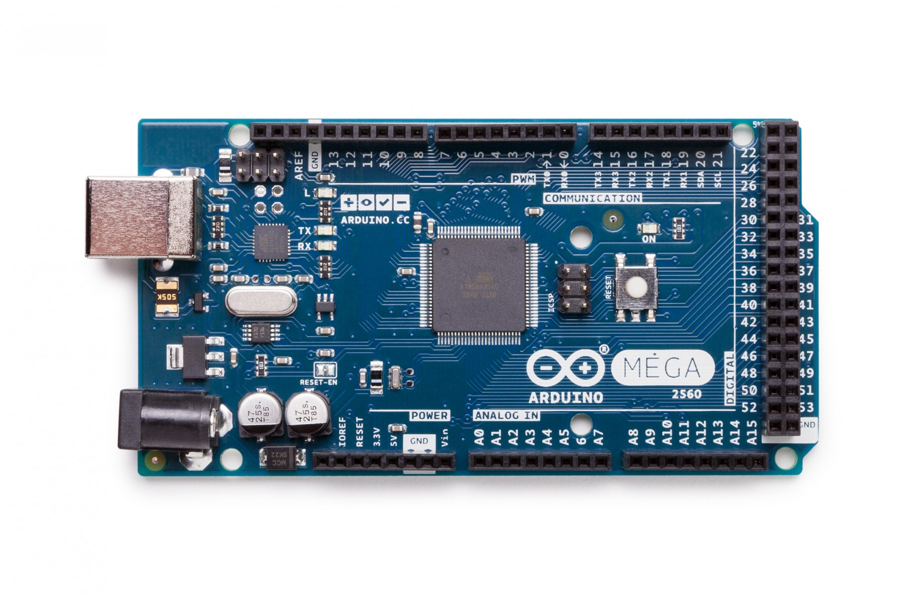
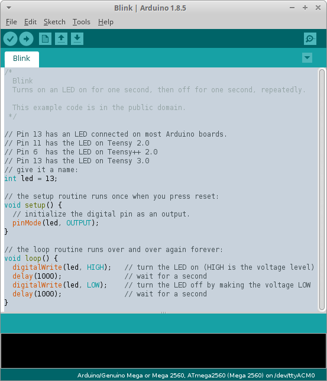

# Arduino

Open-source electronic prototyping platform enabling users to create interactive electronic objects.

## Hardware

Physical programmable circuit boards.

## Software

IDE (Integrated Development Environment)

