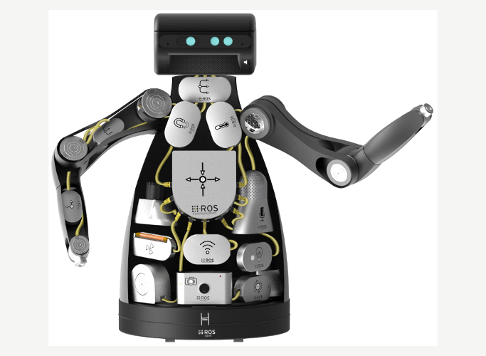

```lisp
(playTone 5000 50)
```

```lisp
(defun playHighPitchTone (x) (playTone 20000 x))
```

```lisp
(playHighPitchTone 50)
```

```
1st Byte - Sync Flag (Value: 0xff)
2nd Byte - Sync Flag / Protocol version
3rd Byte - Message Length (N) - Low Byte
4th Byte - Message Length (N) - High Byte
5th Byte - Checksum over message length
6th Byte - Topic ID - Low Byte
7th Byte - Topic ID - High Byte
N Bytes  - Serialized Message Data
Byte N+8 - Checksum over Topic ID and Message Data
```


[](human-human)
