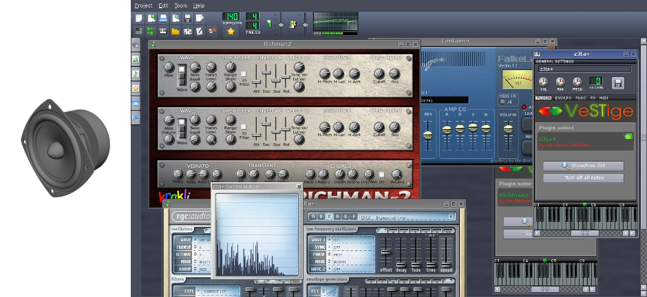

# [](#header-1) Software Language

High-level programming languages add abstraction to machine languages to be
closer to natural human languages.

```python
def askMouseToReachForPellet:
    playTone()

askMouseToReachForPellet()

setToneFrequency(5000)

setToneVolume(50)
```

[](software-electro-mechanical)
