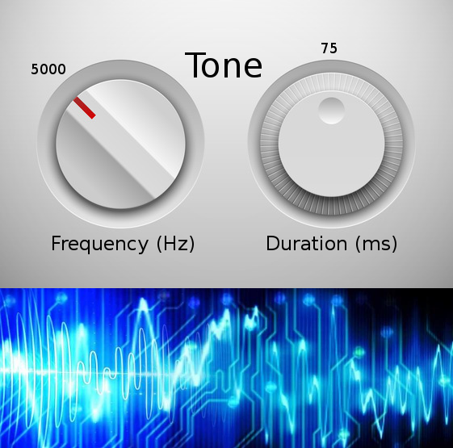

#  Language Options

#  Human

> "Change tone frequency to 5000 Hz please."
>
> "Change tone duration to 75 ms please."

#  Electro-Mechanical

Information is stored kinetically and electronically.

Mass is distributed geometrically in 3D space and time.

Electronic component values and electric signals.

