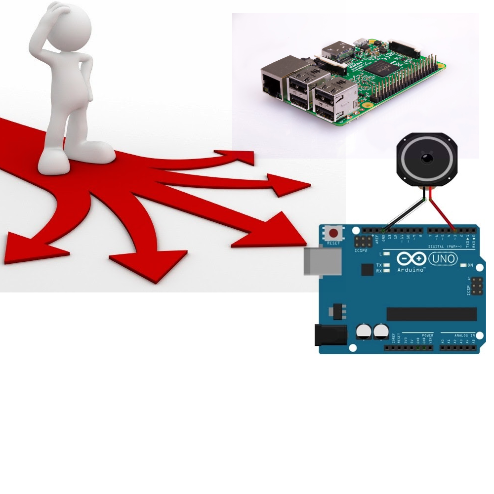

#  Narrow Solution Scope

Project specifications will reduce the space of reasonable solutions.

#  Choice Paralysis

Many options may still exist for solving the problem, how do you pick?

#  Favorite Tool

It might be perfectly acceptable to use any solution that you know well.

Just be careful not to inappropriately treat every problem like a nail just so you can
use your hammer.

#  Try Something New!

